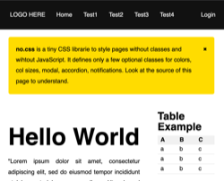
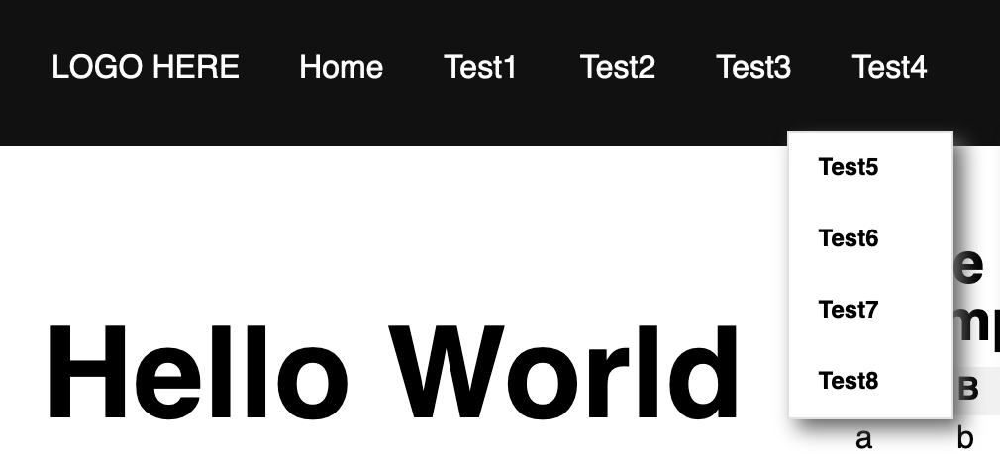
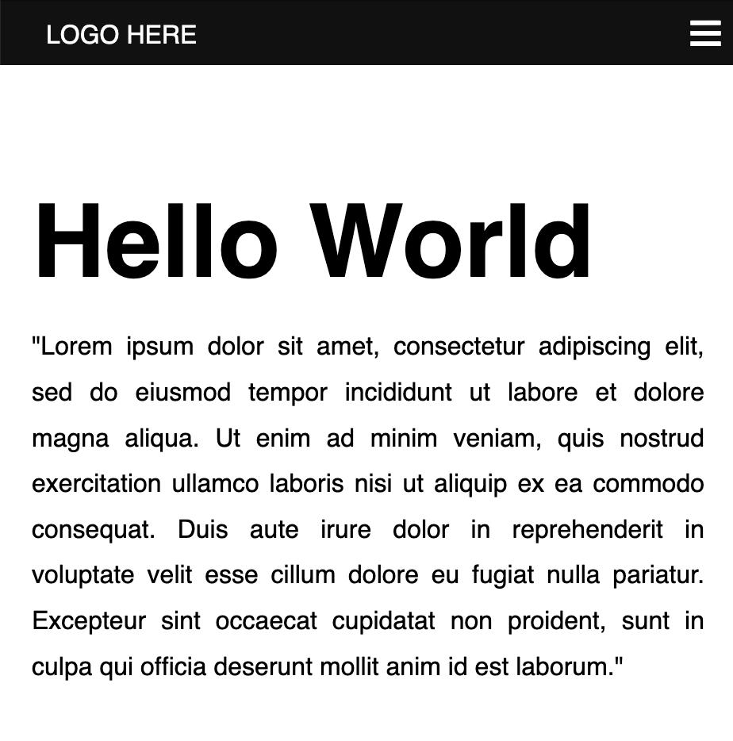
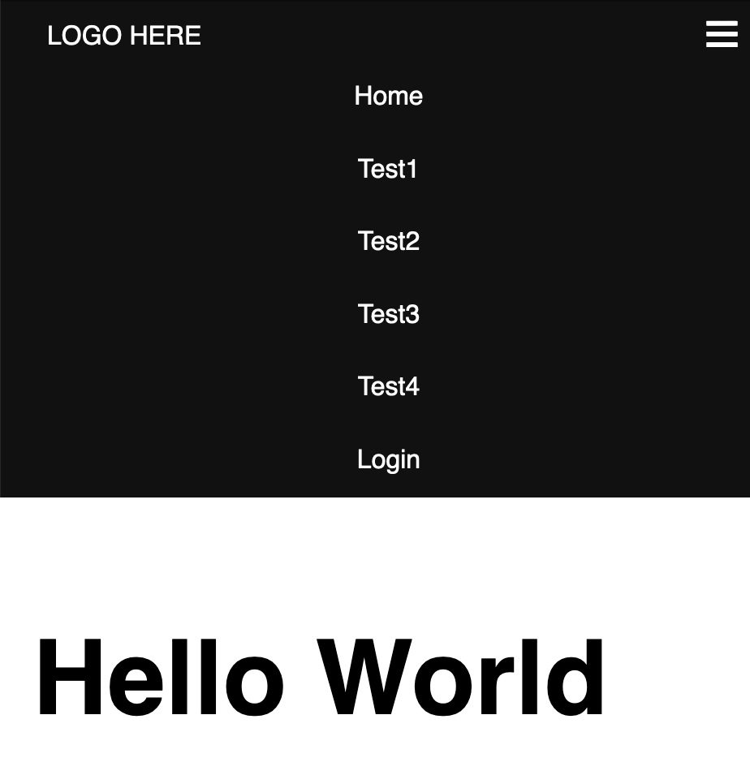
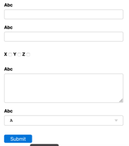
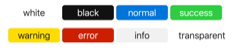
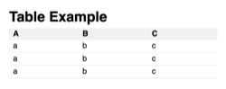
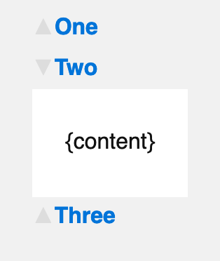
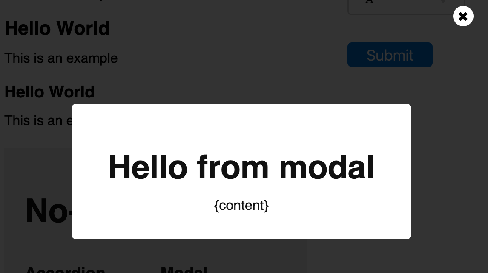

# no.css

[INTERACTIVE DEMO](https://codepen.io/mdipierro/pen/BaKNxbP)

I am tired of adding classes to style my HTML. I just want to include a .css file and I expect it to style the HTML for me.

no.css is a minimalistic CSS library (<8K minified) designed to style pages without need for custom classes. Navigation headers, paragraphs, buttons, tables, forms, menus (with hamburger) are styled automatically. Hence the name NO CSS.

no.css also defined some submenus, accordion, and modal logic in pure CSS and does not require any JS.

The library does define some optional calsses for the following purpose:

```
Grid classes:
  row, col, c25, c33, c50, c66, c75
Colors classes:
  black, white, default, success, warning, error, info, transparent
Effect classes:
  accordion, modal
Other classes:
  full, padded, notification, close
```

## Page structure



no.css assumes the following page structure

```
<html>
  <head>
    <link rel="stylesheet" type="text/css" href="no.css">
  </head>
  <body>
    <nav class="black">...</nav>
    <div class="notification">...optional message...</div>
    <div class="row">
      <div class="c75">...main...</div>
      <div class="c25">...sidebar...</div>
    </div>
    <footer>
      ...
    </footer>
  </body>
</html>
```

## The nav block

**NO JS REQUIRED**

The nav block assumes a logo or link, and two menus implemented as unordered lists: a left menu and a right menu:

```
<nav>
  <!-- if you want a logo -->
  <a>LOGO HERE</a>

  <!-- if you want a hamburger for small screens -->
  <label for="hamburger">&#9776;</label>
  <input type="checkbox" id="hamburger" />

  <!-- first UL is left menu -->
  <ul>
    <li><a>Link1</a></li>
    <li><a>Link2</a></li>
    <li><a>Link3</a>
      <!-- optional sub menu -->
      <ul>
        <li><a>Link4</a></li>
        <li><a>Link5</a></li>
      </ul>
    </li>
  </ul>

  <!-- second UL is right menu -->
  <ul>
    <li><a>Link6</a>
      <ul>
        <li><a>Link7</a></li>
        <li><a>Link8</a></li>
      </ul>
    </li>
  </ul>
</nav>
```




If the screen widths is less than 600px, the yop level menu items may de displayed vertically.

Notice the label in input are hidden unless the screen width is less than 600px. In that case the hamburger is displayed on the right side and it is used to toggle the menu. Notice this does not require any JS but the following order is important:

- logo
- hamburger
- left menu
- right menu

The logo can be omitted.
The hamburger can be omitted but the menu will be always displayed on small screens.
If only one menu (ul) is used, it is assumed to be the left menu. If you only want one menu make the other one empty to preserve position.

You can add more stuff in menu but positioning is not guaranteed and you may have to adjust it with your own CSS.




## Grid

The structure of a grid is the following:

<div class="row">
   <div class="c75">
     ...
   </div>
   <div class="c25">
     ...
   </div>
</div>

This indicates a 75% column and a 25% column. Only predefined column widths are:

- c25 (25%)
- c33 (33%)
- c50 (50%)
- c66 (66%)
- c75 (75%)

Rows can be nested.

If the screen width is less than 600px the columns are displayed as rows.

## Form

Forms elements are styled automatically.




## Colors and Buttons

Supported colors are:

- black
- white
- default (blue)
- success (green)
- warning (yellow)
- error (red)
- info (gray)
- transparent

The above classes set the background color of the element they are applied to. They also set the background color to white or black, depending of what is more appropriate.



## Tables



## Accordion

Unless otherwise specified header will be grey and body will be transparent. Lines will be highlited in light yellow on mouseover. Text is always aligned top-left.

**NO JS REQUIRED**

An accordion works like this:

```
<div class="accordion">
  <input type="checkbox" id="x05">
  <label for="x05">The accordion label goes here</label>
  <div>
     The accordion content goes here
  </div>
</div>
```

The id can have any name as long as unique. The input will be hidden and determine the status of the accordion.

If you want exclusive accorions (where only one tab can be open at one time) you can repeat the patter but use a radio instead of a check box and make sure all the exclusive accordions have radio buttons with the same name but different values.



## Modal

**NO JS REQUIRED**

A modal works like this:

```
<a class="button" href="#popup1">open modal</a>

<center class="modal" id="popup1">
  <div class="white padded">
    The content of the modal
  </div>
</center>
```

The `#{name}` of the modal button must match the id of the `<center class="modal">`.
Clicking on the button opens the modal. Notice when the modal is open it will add `#{name}` to the URL which means the modal is bookmarkabled.

You can have as many modals as you like, as long as they have different trigger buttons and ids.



## License 

MIT

## Acknowledgements

The idea and form styling are taken from https://milligram.io/

## References

For effects in pure CSS, look into https://animate.style/